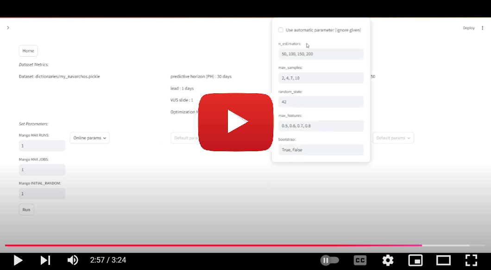
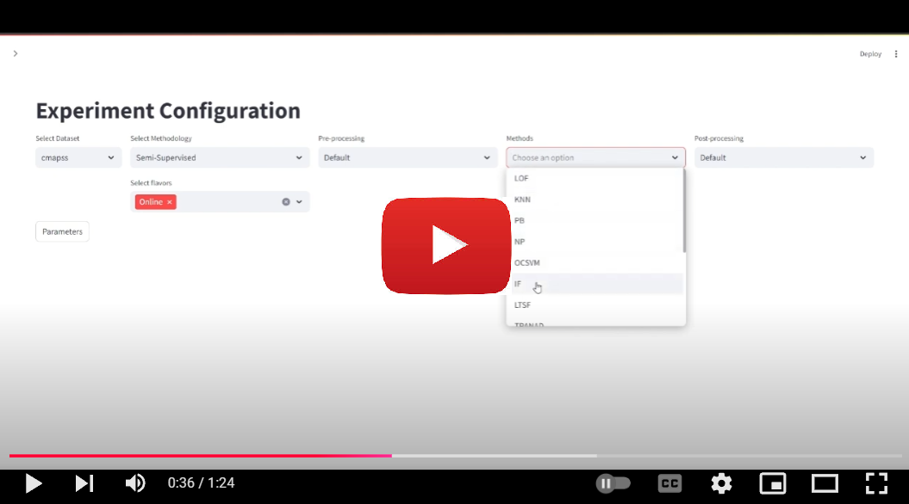

This repository provides an end-to-end system for Predictive Maintenance (PdM), designed to help users build solutions for various PdM cases, including run-to-failure scenarios. Our system integrates preprocessing, anomaly detection methods, flavor selection and postprocessing techniques into a unified framework. It offers full support for Feature Engineering, Machine Learning, automated hyperparameter tuning and Alternative Models Exploration, Testing and Validation (ATV). Users can define their PdM cases by providing time-series data, maintenance records and evaluation criteria. The system optimizes configurations using Bayesian optimization and supports over 12 evaluation metrics, allowing for easy, automated exploration of parameter spaces and Anomaly Detection techniques.

This repository is related to the work titled **Non-supervised anomaly detection for predictive maintenance: an end-to-end system**.

## Extended Evaluation Results

[Analyticals results for different evaluation metrics](evaluation/README.md)

## Examples

[Use your own Dataset](src/pdm-evaluation/example_custom_dataset.ipynb)

[Run experiment](src/pdm-evaluation/example_run_me.ipynb)

[Implement your own method](src/pdm-evaluation/Implement_your_own_method.ipynb)

## Public Data

Download the public data [here](https://drive.google.com/file/d/16n5doY_zkTmMYawp9be7vnULmaSQJYhP/view?usp=sharing).

Place the "DataFolder" inside '/PdM-Evauation/src/pdm-evaluation/'.

## Streamlit Gui

### Run To Failure Dataset:

<a href="https://youtu.be/MZlcqBzubbU">
  
</a>

### Define Failures using Event logs:

<a href="https://youtu.be/Yykzy4Y39kQ">
  
</a>

## Clone the repo

```
git clone git@github.com:PdMAutoML/PdM-Evaluation.git
cd PdM-Evaluation
```

## Create the environment

```
conda env create --file environment.yml
conda activate PdM-Evaluation
```

## Create the DataFolder inside src/pdm-evaluation and put the desired data in it

```
cd src/pdm-evaluation
mkdir DataFolder
```

NOTE: For the Chronos env you will need to manually also install the Chronos package using the following command:

```
pip install git+https://github.com/amazon-science/chronos-forecasting.git
```

## For windows

### Install gcc:

#### Download and Install MSYS2:

Visit the MSYS2 website and download the installer.
Run the installer and follow the installation instructions.

#### Update MSYS2:

After installing, open the MSYS2 shell from the Start Menu and update the package database and the core system packages by running:

```sh
pacman -Syu
```

If it asks you to close the terminal and re-run the command, do so.

#### Install GCC:

Once MSYS2 is updated, you can install the GCC package. Open the MSYS2 shell again and run:

```sh
pacman -S mingw-w64-x86_64-gcc
```

This command installs the GCC compiler for the x86_64 architecture.

#### Add GCC to Your System Path:

This need to run in every new Terminal

```commandline
$env:Path += ';C:\msys64\mingw64\bin'
```

#### Install make command

Visit: https://gnuwin32.sourceforge.net/packages/make.htm

This need to run in every new Terminal

```commandline
$env:Path += ';C:\Program Files (x86)\GnuWin32\bin'
```

## Create the environment

```
conda env create --file environment_windows.yml
conda activate PdM-Evaluation
```

### Install mlflow

```
pip install mlflow
```

### Install torch

This is approximately 3.1 GB

```
pip install torch==1.9.0+cu111 --extra-index-url https://download.pytorch.org/whl/cu111
```

## Running GUI (Streamlit)

```commandline
pip install streamlit
cd .\src\pdm-evaluation\
streamlit run app.py --server.fileWatcherType none
```
