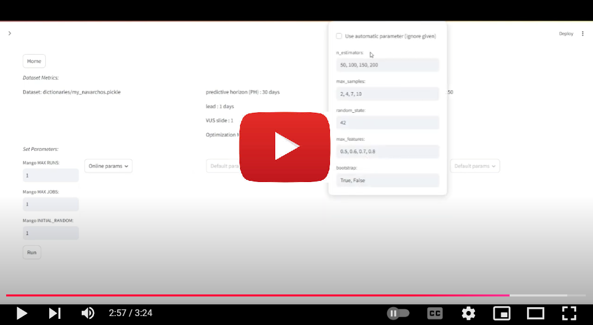
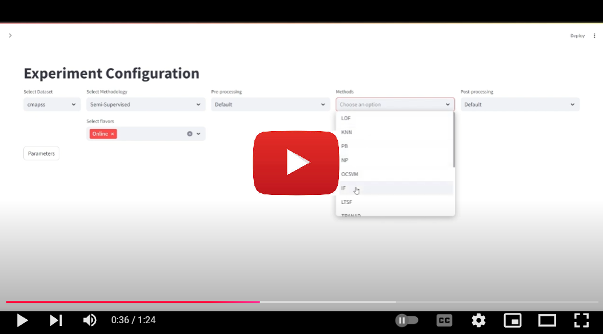

<h2 align='center'>
Towards AutoML Solutions for Predictive Maintenance
</h2>

This repository implements a modular, extensible end-to-end AutoML platform for Predictive Maintenance (PdM). The platform lets practitioners specify PdM use cases via time-series telemetry, maintenance records, and evaluation criteria, and performs joint optimization across pipeline stages while preserving native Python and standard ML APIs.

### Key features

* Joint optimization of preprocessing, anomaly detection, and postprocessing stages with automated hyperparameter tuning.
* Support for Feature Engineering, Machine Learning, and Alternative Models Exploration, Testing and Validation (ATV) [[Karmaker, et al.](https://doi.org/10.1145/3470918)].
* Integration of 24 Time-Series Anomaly Detection (TSAD) methods exposed through four operational flavors.
* Multimodal input support (e.g., sensor streams + maintenance logs) within a unified framework.
* Bayesian-optimization backend for efficient configuration search and support for 12+ evaluation metrics.
* Declarative control over incident-driven policies and domain-relevant evaluation protocols.
* Designed for easy integration into existing Python workflows.

If you find our work helpful, please consider giving a star :smiley:

## Usage examples

[Use your own dataset](src/pdm-evaluation/example_custom_dataset.ipynb)

[Run an experiment](src/pdm-evaluation/example_run_me.ipynb)

[Integrate your own anomaly detection method](src/pdm-evaluation/Implement_your_own_method.ipynb)

## Streamlit GUI showcase

### Run-to-failure PdM case:

<a href="https://youtu.be/MZlcqBzubbU">
  
</a>

### Define incidents in a declarative way:

<a href="https://youtu.be/Yykzy4Y39kQ">
  
</a>

## How to clone the repository

```
git clone git@github.com:PdMAutoML/PdM-Evaluation.git
cd PdM-Evaluation
```

## Creating the Anaconda environment

```
conda env create --file environment.yml
conda activate PdM-Evaluation
```
## Datasets

You can download the datasets from [here](https://drive.google.com/file/d/1SznGwgV_F62kY0zI0rmgaMWry1aQa_kK/view?usp=sharing).

### Extract the datasets inside src/pdm-evaluation/DataFolder

```
cd src/pdm-evaluation
mkdir DataFolder
```

## For Windows OS

### Download and Install MSYS2:

Visit the MSYS2 website and download the installer.
Run the installer and follow the installation instructions.

### Update MSYS2:

After installing, open the MSYS2 shell from the Start Menu and update the package database and the core system packages by running:

```sh
pacman -Syu
```

If it asks you to close the terminal and re-run the command, do so.

### Install GCC:

Once MSYS2 is updated, you can install the GCC package. Open the MSYS2 shell again and run:

```sh
pacman -S mingw-w64-x86_64-gcc
```

This command installs the GCC compiler for the x86_64 architecture.

### Add GCC to Your System Path:

Run the following in every new terminal session

```commandline
$env:Path += ';C:\msys64\mingw64\bin'
```

### Install make command

Visit: https://gnuwin32.sourceforge.net/packages/make.htm

Run the following in every new terminal session

```commandline
$env:Path += ';C:\Program Files (x86)\GnuWin32\bin'
```

### Create the Anaconda environment

```
conda env create --file environment_windows.yml
conda activate PdM-Evaluation
```

### Install MLflow

```
pip install mlflow
```

### Install PyTorch

```
pip install torch==1.9.0+cu111 --extra-index-url https://download.pytorch.org/whl/cu111
```

### How to spawn the GUI (Streamlit)

```commandline
pip install streamlit
cd .\src\pdm-evaluation\
streamlit run app.py --server.fileWatcherType none
```
