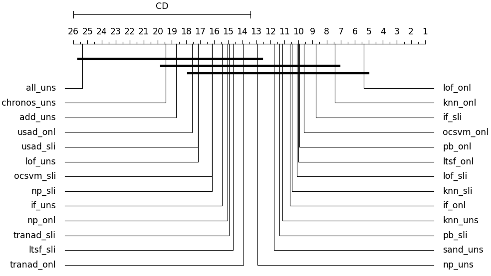

# Evaluation Results for different Metrics.

## Table of Contents
- [Evaluation with PR AUC AD1](#evaluation-with-pr-auc-ad1)
- [Evaluation with F1 AD1](#evaluation-with-f1-ad1)
- [Evaluation with PR VUS](#evaluation-with-pr-vus)
- [Evaluation with PR AUC AD2](#evaluation-with-pr-auc-ad2)
- [Evaluation with F1 AD2](#evaluation-with-f1-ad2)

## Investigated Datasets

| Dataset                           | Preprocesing                                                                                                                                                                                                                                                                                                                                                         | Source      |
|-----------------------------------|----------------------------------------------------------------------------------------------------------------------------------------------------------------------------------------------------------------------------------------------------------------------------------------------------------------------------------------------------------------------|-------------|
| Femto                             | Peak-to-peak, root mean square (RMS) for each signal on each timestamp . Fourier transformation for each signal on each timestamp with binning of size 20 on the frequency spectrum                                                                                                                                                                                  | Download Mirror: https://phm-datasets.s3.amazonaws.com/NASA/10.+FEMTO+Bearing.zip . Data Set Citation: "FEMTO Bearing Data Set", NASA Prognostics Data Repository, NASA Ames Research Center, Moffett Field, CA. Publication Citation: P. Nectoux, R. Gouriveau, K. Medjaher, E. Ramasso, B. Morello, N. Zerhouni, C. Varnier. PRONOSTIA: An Experimental Platform for Bearings Accelerated Life Test. Institute of Electrical and Electronics Engineers (IEEE) International Conference on Prognostics and Health Management, Denver, CO, USA, 2012 |
| IMS                               | Peak-to-peak, root mean square (RMS) for each signal on each timestamp . Fourier transformation for each signal on each timestamp with binning of size 20 on the frequency spectrum                                                                                                                                                                                  | https://phm-datasets.s3.amazonaws.com/NASA/4.+Bearings.zip IMS, University of Cincinnati. "Bearing Data Set", NASA Prognostics Data Repository, NASA Ames Research  Center, Moffett Field, CA |
| C-MAPSS                           | Remove columns that have standard deviation close to 0 with tolerance 0.000001                                                                                                                                                                                                                                                                                       | Download: https://data.nasa.gov/Aeorspace/CMAPSS-Jet-Engine-Simulated-Data/ff5v-kuh6 . Data Set Citation: A. Saxena and K. Goebel (2008). "Turbofan Engine Degradation Simulation Data Set", NASA Prognostics Data Repository, NASA Ames Research Center, Moffett Field, CA |
| Azure                             | -                                                                                                                                                                                                                                                                                                                                                                    | https://www.kaggle.com/datasets/arnabbiswas1/microsoft-azure-predictive-maintenance?select=PdM_telemetry.csv |
| Navarchos                         | -                                                                                                                                                                                                                                                                                                                                                                    | https://github.com/agiannoul/NavarchosPdM |
| EDP-WT (wind farms 2017)          | Forward fill Null values. Remove duplicate timestamps. Remove constant columns. Remove failure timestamp for turbine id T07 on 2017-08-20                                                                                                                                                                                                                            | https://opendata.edp.com/open-data/en/data.html |
| BHD                               | Extract all disk ids (sources) that failed during 2023. Find SMART measurements from the moment each disk was installed until it failed. Transform malformed dates. Remove constant columns. Remove scenarios with less than 30 points. Remove duplicate timestamps. Keep the two largest scenarios for each unique disk model type or just one if there is only one | https://www.backblaze.com/cloud-storage/resources/hard-drive-test-data |
| XJTU-SY                           | Peak-to-peak, root mean square (RMS) for each signal on each timestamp, Fourier transformation for each signal on each timestamp with binning of size 20 on the frequency spectrum.                                                                                                                                                                                  | https://github.com/WangBiaoXJTU/xjtu-sy-bearing-datasets#xjtu-sy-bearing-datasets |
| MetroPT-3                         | 10-minutes mean aggregation, Drop null values                                                                                                                                                                                                                                                                                                                        | https://archive.ics.uci.edu/dataset/791/metropt+3+dataset |
| AI4I 2020 Predictive Maintenance  | Remove failure timestamps from episodes with length <= 12. Extract tool replacement timestamps and add them to reset events. Forward fill Null values. Drop duplicate timestamps                                                                                                                                                                                     | https://archive.ics.uci.edu/dataset/601/ai4i+2020+predictive+maintenance+datasete.ics.uci.edu/dataset/601/ai4i+2020+predictive+maintenance+dataset |

## Evaluation with PR AUC AD1

### Violin plot for each technique across all datasets

### Best combination per Dataset

### Critical Diagram of different combination across all datasets

### Performance per Dataset 

### Table with best PR AUC AD1 performance for different methods and flavors
| Dataset | Method | Online | Sliding | Historical | Unsupervised |
| --- | --- | --- | --- | --- | --- |
| CMAPSS | pb | 0.21 | 0.195 | 0.158 | - |
| CMAPSS | knn | 0.445 | 0.292 | 0.342 | 0.201 |
| CMAPSS | if | 0.258 | 0.323 | 0.243 | 0.339 |
| CMAPSS | lof | 0.357 | 0.351 | 0.36 | 0.108 |
| CMAPSS | np | 0.099 | 0.092 | 0.079 | 0.079 |
| CMAPSS | sand | - | - | - | 0.881 |
| CMAPSS | ocsvm | 0.595 | 0.329 | 0.542 | - |
| CMAPSS | ltsf | 0.108 | 0.06 | 0.097 | - |
| CMAPSS | tranad | 0.087 | 0.095 | 0.085 | - |
| CMAPSS | usad | 0.162 | 0.093 | 0.188 | - |
| CMAPSS | chronos | - | - | - | 0.2 |
| CMAPSS | all | - | - | - | 0.049 |
| CMAPSS | add | - | - | - | 0.157 |
| METRO | pb | 0.358 | 0.709 | - | - |
| METRO | knn | 0.463 | 0.655 | - | 0.615 |
| METRO | if | 0.745 | 0.648 | - | 0.531 |
| METRO | lof | 0.677 | 0.671 | - | 0.523 |
| METRO | np | 0.661 | 0.435 | - | 0.49 |
| METRO | sand | - | - | - | 0.52 |
| METRO | ocsvm | 0.314 | 0.391 | - | - |
| METRO | ltsf | 0.554 | 0.646 | - | - |
| METRO | tranad | 0.846 | 0.831 | - | - |
| METRO | usad | 0.258 | 0.406 | - | - |
| METRO | chronos | 0.2 | - | - | 0.3 |
| METRO | all | - | - | - | 0.037 |
| METRO | add | - | - | - | 0.289 |
| Navarchos | pb | 0.148 | 0.399 | - | - |
| Navarchos | knn | 0.322 | 0.364 | - | 0.224 |
| Navarchos | if | 0.388 | 0.423 | - | 0.2 |
| Navarchos | lof | 0.371 | 0.102 | - | 0.144 |
| Navarchos | np | 0.315 | 0.363 | - | 0.055 |
| Navarchos | sand | - | - | - | 0.066 |
| Navarchos | ocsvm | 0.519 | 0.518 | - | - |
| Navarchos | ltsf | 0.063 | 0.334 | - | - |
| Navarchos | tranad | 0.071 | 0.097 | - | - |
| Navarchos | usad | 0.048 | 0.019 | - | - |
| Navarchos | chronos | 0.039 | - | - | 0.09 |
| Navarchos | all | - | - | - | 0.035 |
| Navarchos | add | - | - | - | 0.015 |
| IMS | pb | 0.915 | 0.98 | - | - |
| IMS | knn | 0.82 | 0.955 | - | 1.0 |
| IMS | if | 1.0 | 0.933 | - | 0.655 |
| IMS | lof | 1.0 | 0.955 | - | 0.733 |
| IMS | np | 0.828 | 0.875 | - | 1.0 |
| IMS | sand | - | - | - | 0.884 |
| IMS | ocsvm | 0.941 | 0.597 | - | - |
| IMS | ltsf | 0.887 | 0.888 | - | - |
| IMS | tranad | 1.0 | 1.0 | - | - |
| IMS | usad | 1.0 | 0.926 | - | - |
| IMS | chronos | 0.528 | - | - | 0.241 |
| IMS | all | - | - | - | 0.030 |
| IMS | add | - | - | - | 0.355 |
| FEMTO | pb | 0.744 | 0.791 | 0.794 | - |
| FEMTO | knn | 0.892 | 0.987 | 0.853 | 0.843 |
| FEMTO | if | 0.581 | 0.985 | 0.932 | 0.667 |
| FEMTO | lof | 0.89 | 0.9 | 0.818 | 0.393 |
| FEMTO | np | 0.46 | 0.53 | 0.489 | 0.887 |
| FEMTO | sand | - | - | - | 0.996 |
| FEMTO | ocsvm | 0.89 | 0.488 | 0.855 | - |
| FEMTO | ltsf | 0.812 | 0.892 | 0.768 | - |
| FEMTO | tranad | 0.777 | 0.777 | 0.779 | - |
| FEMTO | usad | 0.25 | 0.681 | 0.67 | - |
| FEMTO | chronos | 0.372 | - | - | 0.175 |
| FEMTO | all | - | - | - | 0.039 |
| FEMTO | add | - | - | - | 0.21 |
| BHD | pb | 0.015 | 0.011 | - | - |
| BHD | knn | 0.019 | 0.008 | - | 0.008 |
| BHD | if | 0.006 | 0.016 | - | 0.008 |
| BHD | lof | 0.033 | 0.011 | - | 0.012 |
| BHD | np | 0.012 | 0.017 | - | 0.525 |
| BHD | sand | - | - | - | 0.219 |
| BHD | ocsvm | 0.006 | 0.006 | - | - |
| BHD | ltsf | 0.018 | 0.01 | - | - |
| BHD | tranad | 0.009 | 0.009 | - | - |
| BHD | usad | 0.01 | 0.015 | - | - |
| BHD | chronos | 0.01 | - | - | 0.01 |
| BHD | all | - | - | - | 0.005 |
| BHD | add | - | - | - | 0.047 |
| AZURE | pb | 0.488 | 0.289 | - | - |
| AZURE | knn | 0.398 | 0.354 | - | 0.431 |
| AZURE | if | 0.332 | 0.486 | - | 0.138 |
| AZURE | lof | 0.392 | 0.365 | - | 0.167 |
| AZURE | np | 0.285 | 0.124 | - | 0.112 |
| AZURE | sand | - | - | - | 0.092 |
| AZURE | ocsvm | 0.445 | 0.223 | - | - |
| AZURE | ltsf | 0.248 | 0.139 | - | - |
| AZURE | tranad | 0.083 | 0.079 | - | - |
| AZURE | usad | 0.114 | 0.11 | - | - |
| AZURE | chronos | 0.133 | - | - | 0.11 |
| AZURE | all | - | - | - | 0.075 |
| AZURE | add | - | - | - | 0.074 |
| EDP | pb | 0.98 | 0.919 | - | - |
| EDP | knn | 0.964 | 0.918 | - | 0.852 |
| EDP | if | 0.943 | 0.86 | - | 0.791 |
| EDP | lof | 0.963 | 0.878 | - | 0.818 |
| EDP | np | 0.692 | 0.806 | - | 0.78 |
| EDP | sand | - | - | - | 0.853 |
| EDP | ocsvm | 0.961 | 0.805 | - | - |
| EDP | ltsf | 0.98 | 0.836 | - | - |
| EDP | tranad | 0.536 | 0.507 | - | - |
| EDP | usad | 0.915 | 0.932 | - | - |
| EDP | chronos | 0.41 | - | - | 0.64 |
| EDP | all | - | - | - | 0.318 |
| EDP | add | - | - | - | 0.67 |
| XJTU | pb | 0.527 | 0.22 | - | - |
| XJTU | knn | 0.724 | 0.643 | - | 0.653 |
| XJTU | if | 0.187 | 0.182 | - | 0.114 |
| XJTU | lof | 0.567 | 0.181 | - | 0.062 |
| XJTU | np | 0.048 | 0.075 | - | 0.714 |
| XJTU | sand | - | - | - | 0.417 |
| XJTU | ocsvm | 0.335 | 0.274 | - | - |
| XJTU | ltsf | 0.765 | 0.504 | - | - |
| XJTU | tranad | 0.678 | 0.674 | - | - |
| XJTU | usad | 0.13 | 0.044 | - | - |
| XJTU | chronos | 0.524 | - | - | 0.353 |
| XJTU | all | - | - | - | 0.02 |
| XJTU | add | - | - | - | 0.11 |
| AI4I | pb | 0.051 | 0.032 | - | - |
| AI4I | knn | 0.051 | 0.033 | - | 0.038 |
| AI4I | if | 0.042 | 0.04 | - | 0.044 |
| AI4I | lof | 0.05 | 0.042 | - | 0.038 |
| AI4I | np | 0.045 | 0.04 | - | 0.042 |
| AI4I | sand | - | - | - | 0.039 |
| AI4I | ocsvm | 0.044 | 0.035 | - | - |
| AI4I | ltsf | 0.065 | 0.0 | - | - |
| AI4I | tranad | 0.043 | 0.035 | - | - |
| AI4I | usad | 0.034 | 0.039 | - | - |
| AI4I | chronos | 0.04 | - | - | 0.036 |
| AI4I | all | - | - | - | 0.034 |
| AI4I | add | - | - | - | 0.11 |

## Evaluation with F1 AD1

### Violin plot for each technique across all datasets

### Best combination per Dataset

### Critical Diagram of different combination across all datasets

### Performance per Dataset 

### Table with best F1 AD1 performance for different methods and flavors
| Dataset | Method | Online | Sliding | Historical | Unsupervised |
| --- | --- | --- | --- | --- | --- |
| CMAPSS | pb | 0.251 | 0.253 | 0.202 | - |
| CMAPSS | knn | 0.488 | 0.427 | 0.432 | 0.403 |
| CMAPSS | if | 0.3 | 0.385 | 0.302 | 0.174 |
| CMAPSS | lof | 0.452 | 0.397 | 0.416 | 0.169 |
| CMAPSS | np | 0.138 | 0.133 | 0.114 | 0.658 |
| CMAPSS | sand | - | - | - | 0.849 |
| CMAPSS | ocsvm | 0.38 | 0.221 | 0.347 | - |
| CMAPSS | ltsf | 0.121 | 0.112 | 0.105 | - |
| CMAPSS | tranad | 0.121 | 0.133 | 0.113 | - |
| CMAPSS | usad | 0.102 | 0.121 | 0.094 | - |
| CMAPSS | chronos | 0.101 | - | 0.101 | 0.101 |
| CMAPSS | add | - | - | - | 0.255 |
| CMAPSS | all | - | - | - | 0.094 |
| METRO | pb | 0.544 | 0.731 | - | - |
| METRO | knn | 0.547 | 0.683 | - | 0.581 |
| METRO | if | 0.699 | 0.553 | - | 0.159 |
| METRO | lof | 0.622 | 0.624 | - | 0.444 |
| METRO | np | 0.576 | 0.431 | - | 0.64 |
| METRO | sand | - | - | - | 0.363 |
| METRO | ocsvm | 0.534 | 0.365 | - | - |
| METRO | ltsf | 0.462 | 0.621 | - | - |
| METRO | tranad | 0.747 | 0.736 | - | - |
| METRO | usad | 0.39 | 0.497 | - | - |
| METRO | chronos | 0.348 | - | - | 0.11 |
| METRO | add | - | - | - | 0.4 |
| METRO | all | - | - | - | 0.072 |
| Navarchos | pb | 0.163 | 0.154 | - | - |
| Navarchos | knn | 0.176 | 0.178 | - | 0.142 |
| Navarchos | if | 0.107 | 0.096 | - | 0.196 |
| Navarchos | lof | 0.133 | 0.161 | - | 0.167 |
| Navarchos | np | 0.089 | 0.147 | - | 0.142 |
| Navarchos | sand | - | - | - | 0.117 |
| Navarchos | ocsvm | 0.472 | 0.244 | - | - |
| Navarchos | ltsf | 0.145 | 0.182 | - | - |
| Navarchos | tranad | 0.125 | 0.171 | - | - |
| Navarchos | usad | 0.113 | 0.072 | - | - |
| Navarchos | chronos | 0.127 | - | - | 0.143 |
| Navarchos | add | - | - | - | 0.069 |
| Navarchos | all | - | - | - | 0.069 |
| IMS | pb | 0.8 | 0.935 | - | - |
| IMS | knn | 0.702 | 0.952 | - | 1.0 |
| IMS | if | 1.0 | 0.815 | - | 0.472 |
| IMS | lof | 1.0 | 0.912 | - | 0.635 |
| IMS | np | 0.8 | 0.857 | - | 1.0 |
| IMS | sand | - | - | - | 0.815 |
| IMS | ocsvm | 0.938 | 0.339 | - | - |
| IMS | ltsf | 0.8 | 0.8 | - | - |
| IMS | tranad | 1.0 | 1.0 | - | - |
| IMS | usad | 1.0 | 0.876 | - | - |
| IMS | chronos | 0.636 | - | - | 0.388 |
| IMS | add | - | - | - | 0.5 |
| IMS | all | - | - | - | 0.06 |
| FEMTO | pb | 0.789 | 0.733 | 0.791 | - |
| FEMTO | knn | 0.9 | 0.917 | 0.8 | 0.865 |
| FEMTO | if | 0.628 | 0.96 | 0.952 | 0.584 |
| FEMTO | lof | 0.909 | 0.905 | 0.822 | 0.324 |
| FEMTO | np | 0.471 | 0.403 | 0.423 | 0.841 |
| FEMTO | sand | - | - | - | 0.976 |
| FEMTO | ocsvm | 0.882 | 0.379 | 0.8 | - |
| FEMTO | ltsf | 0.795 | 0.885 | 0.698 | - |
| FEMTO | tranad | 0.712 | 0.706 | 0.641 | - |
| FEMTO | usad | 0.279 | 0.8 | 0.78 | - |
| FEMTO | chronos | 0.471 | - | 0.571 | 0.317 |
| FEMTO | add | - | - | - | 0.286 |
| FEMTO | all | - | - | - | 0.077 |
| BHD | pb | 0.044 | 0.038 | - | - |
| BHD | knn | 0.039 | 0.024 | - | 0.023 |
| BHD | if | 0.022 | 0.041 | - | 0.028 |
| BHD | lof | 0.045 | 0.036 | - | 0.035 |
| BHD | np | 0.029 | 0.042 | - | 0.503 |
| BHD | sand | - | - | - | 0.336 |
| BHD | ocsvm | 0.013 | 0.021 | - | - |
| BHD | ltsf | 0.038 | 0.0 | - | - |
| BHD | tranad | 0.028 | 0.029 | - | - |
| BHD | usad | 0.025 | 0.039 | - | - |
| BHD | chronos | 0.027 | - | - | 0.023 |
| BHD | add | - | - | - | 0.096 |
| BHD | all | - | - | - | 0.01 |
| AZURE | pb | 0.376 | 0.333 | - | - |
| AZURE | knn | 0.38 | 0.325 | - | 0.314 |
| AZURE | if | 0.373 | 0.327 | - | 0.181 |
| AZURE | lof | 0.369 | 0.338 | - | 0.187 |
| AZURE | np | 0.306 | 0.193 | - | 0.156 |
| AZURE | sand | - | - | - | 0.181 |
| AZURE | ocsvm | 0.447 | 0.329 | - | - |
| AZURE | ltsf | 0.274 | 0.186 | - | - |
| AZURE | tranad | 0.152 | 0.141 | - | - |
| AZURE | usad | 0.188 | 0.154 | - | - |
| AZURE | chronos | 0.172 | - | - | 0.172 |
| AZURE | add | - | - | - | 0.17 |
| AZURE | all | - | - | - | 0.141 |
| EDP | pb | 0.98 | 0.919 | - | - |
| EDP | knn | 0.964 | 0.918 | - | 0.812 |
| EDP | if | 0.943 | 0.86 | - | 0.791 |
| EDP | lof | 0.963 | 0.878 | - | 0.818 |
| EDP | np | 0.692 | 0.806 | - | 0.78 |
| EDP | sand | - | - | - | 0.853 |
| EDP | ocsvm | 0.961 | 0.805 | - | - |
| EDP | ltsf | 0.98 | 0.836 | - | - |
| EDP | tranad | 0.536 | 0.507 | - | - |
| EDP | usad | 0.915 | 0.932 | - | - |
| EDP | chronos | 0.56 | - | - | 0.486 |
| EDP | add | - | - | - | 0.602 |
| EDP | all | - | - | - | 0.483 |
| XJTU | pb | 0.503 | 0.321 | - | - |
| XJTU | knn | 0.7 | 0.602 | - | 0.632 |
| XJTU | if | 0.322 | 0.276 | - | 0.217 |
| XJTU | lof | 0.559 | 0.289 | - | 0.129 |
| XJTU | np | 0.129 | 0.164 | - | 0.75 |
| XJTU | sand | - | - | - | 0.447 |
| XJTU | ocsvm | 0.513 | 0.483 | - | - |
| XJTU | ltsf | 0.789 | 0.572 | - | - |
| XJTU | tranad | 0.662 | 0.656 | - | - |
| XJTU | usad | 0.182 | 0.135 | - | - |
| XJTU | chronos | 0.615 | - | - | 0.535 |
| XJTU | add | - | - | - | 0.199 |
| XJTU | all | - | - | - | 0.051 |
| AI4I | pb | 0.114 | 0.069 | - | - |
| AI4I | knn | 0.114 | 0.069 | - | 0.081 |
| AI4I | if | 0.083 | 0.083 | - | 0.079 |
| AI4I | lof | 0.092 | 0.074 | - | 0.078 |
| AI4I | np | 0.086 | 0.082 | - | 0.093 |
| AI4I | sand | - | - | - | 0.077 |
| AI4I | ocsvm | 0.085 | 0.07 | - | - |
| AI4I | ltsf | 0.132 | 0.0 | - | - |
| AI4I | tranad | 0.08 | 0.072 | - | - |
| AI4I | usad | 0.071 | 0.081 | - | - |
| AI4I | chronos | 0.08 | - | - | 0.074 |
| AI4I | add | - | - | - | 0.205 |
| AI4I | all | - | - | - | 0.068 |

## Evaluation with PR VUS

### Violin plot for each technique across all datasets

### Best combination per Dataset

### Critical Diagram of different combination across all datasets

### Performance per Dataset 

### Table with best PR VUS performance for different methods and flavors

| Dataset | Method | Online | Sliding | Historical | Unsupervised |
| --- | --- | --- | --- | --- | --- |
| CMAPSS | pb | 0.188 | 0.173 | 0.172 | - |
| CMAPSS | knn | 0.476 | 0.397 | 0.428 | 0.286 |
| CMAPSS | if | 0.228 | 0.298 | 0.231 | 0.143 |
| CMAPSS | lof | 0.454 | 0.309 | 0.385 | 0.125 |
| CMAPSS | np | 0.121 | 0.551 | 0.102 | 0.551 |
| CMAPSS | sand | - | - | - | 0.625 |
| CMAPSS | ocsvm | 0.609 | 0.381 | 0.529 | - |
| CMAPSS | ltsf | 0.105 | 0.551 | 0.103 | - |
| CMAPSS | tranad | 0.111 | 0.114 | 0.109 | - |
| CMAPSS | usad | 0.102 | 0.105 | 0.101 | - |
| CMAPSS | chronos | 0.106 | - | 0.106 | 0.106 |
| CMAPSS | add | - | - | - | 0.247 |
| CMAPSS | all | - | - | - | 0.549 |
| METRO | pb | 0.211 | 0.189 | - | - |
| METRO | knn | 0.211 | 0.236 | - | 0.543 |
| METRO | if | 0.346 | 0.251 | - | 0.113 |
| METRO | lof | 0.272 | 0.321 | - | 0.241 |
| METRO | np | 0.182 | 0.543 | - | 0.543 |
| METRO | sand | - | - | - | 0.167 |
| METRO | ocsvm | 0.543 | 0.181 | - | - |
| METRO | ltsf | 0.194 | 0.594 | - | - |
| METRO | tranad | 0.347 | 0.376 | - | - |
| METRO | usad | 0.117 | 0.166 | - | - |
| METRO | chronos | 0.122 | - | - | 0.077 |
| METRO | add | - | - | - | 0.145 |
| METRO | all | - | - | - | 0.543 |
| Navarchos | pb | 0.032 | 0.04 | - | - |
| Navarchos | knn | 0.033 | 0.042 | - | 0.518 |
| Navarchos | if | 0.034 | 0.033 | - | 0.037 |
| Navarchos | lof | 0.037 | 0.035 | - | 0.037 |
| Navarchos | np | 0.518 | 0.518 | - | 0.518 |
| Navarchos | sand | - | - | - | 0.04 |
| Navarchos | ocsvm | 0.518 | 0.465 | - | - |
| Navarchos | ltsf | 0.035 | 0.039 | - | - |
| Navarchos | tranad | 0.033 | 0.035 | - | - |
| Navarchos | usad | 0.045 | 0.033 | - | - |
| Navarchos | chronos | 0.037 | - | - | 0.04 |
| Navarchos | add | - | - | - | 0.03 |
| Navarchos | all | - | - | - | 0.518 |
| IMS | pb | 0.43 | 0.44 | - | - |
| IMS | knn | 0.404 | 0.391 | - | 0.468 |
| IMS | if | 0.806 | 0.673 | - | 0.163 |
| IMS | lof | 0.54 | 0.444 | - | 0.151 |
| IMS | np | 0.254 | 0.528 | - | 0.624 |
| IMS | sand | - | - | - | 0.268 |
| IMS | ocsvm | 0.485 | 0.39 | - | - |
| IMS | ltsf | 0.38 | 0.528 | - | - |
| IMS | tranad | 0.499 | 0.562 | - | - |
| IMS | usad | 0.734 | 0.66 | - | - |
| IMS | chronos | 0.249 | - | - | 0.212 |
| IMS | add | - | - | - | 0.159 |
| IMS | all | - | - | - | 0.528 |
| FEMTO | pb | 0.318 | 0.363 | 0.435 | - |
| FEMTO | knn | 0.466 | 0.528 | 0.383 | 0.383 |
| FEMTO | if | 0.295 | 0.49 | 0.512 | 0.236 |
| FEMTO | lof | 0.427 | 0.322 | 0.39 | 0.189 |
| FEMTO | np | 0.113 | 0.538 | 0.389 | 0.565 |
| FEMTO | sand | - | - | - | 0.743 |
| FEMTO | ocsvm | 0.494 | 0.412 | 0.418 | - |
| FEMTO | ltsf | 0.297 | 0.538 | 0.252 | - |
| FEMTO | tranad | 0.372 | 0.363 | 0.358 | - |
| FEMTO | usad | 0.125 | 0.365 | 0.402 | - |
| FEMTO | chronos | 0.259 | - | 0.312 | 0.178 |
| FEMTO | add | - | - | - | 0.114 |
| FEMTO | all | - | - | - | 0.538 |
| BHD | pb | 0.011 | 0.009 | - | - |
| BHD | knn | 0.011 | 0.01 | - | 0.504 |
| BHD | if | 0.008 | 0.011 | - | 0.022 |
| BHD | lof | 0.012 | 0.01 | - | 0.01 |
| BHD | np | 0.504 | 0.504 | - | 0.504 |
| BHD | sand | - | - | - | 0.141 |
| BHD | ocsvm | 0.504 | 0.503 | - | - |
| BHD | ltsf | 0.01 | 0.504 | - | - |
| BHD | tranad | 0.012 | 0.012 | - | - |
| BHD | usad | 0.013 | 0.017 | - | - |
| BHD | chronos | 0.012 | - | - | 0.011 |
| BHD | add | - | - | - | 0.015 |
| BHD | all | - | - | - | 0.504 |
| AZURE | pb | 0.149 | 0.144 | - | - |
| AZURE | knn | 0.15 | 0.148 | - | 0.555 |
| AZURE | if | 0.154 | 0.15 | - | 0.119 |
| AZURE | lof | 0.145 | 0.143 | - | 0.119 |
| AZURE | np | 0.124 | 0.555 | - | 0.555 |
| AZURE | sand | - | - | - | 0.123 |
| AZURE | ocsvm | 0.523 | 0.396 | - | - |
| AZURE | ltsf | 0.12 | 0.555 | - | - |
| AZURE | tranad | 0.098 | 0.1 | - | - |
| AZURE | usad | 0.118 | 0.118 | - | - |
| AZURE | chronos | 0.08 | - | - | 0.115 |
| AZURE | add | - | - | - | 0.106 |
| AZURE | all | - | - | - | 0.555 |
| EDP | pb | 0.408 | 0.376 | - | - |
| EDP | knn | 0.386 | 0.352 | - | 0.314 |
| EDP | if | 0.498 | 0.358 | - | 0.324 |
| EDP | lof | 0.448 | 0.378 | - | 0.327 |
| EDP | np | 0.413 | 0.36 | - | 0.343 |
| EDP | sand | - | - | - | 0.341 |
| EDP | ocsvm | 0.653 | 0.651 | - | - |
| EDP | ltsf | 0.375 | 0.334 | - | - |
| EDP | tranad | 0.332 | 0.328 | - | - |
| EDP | usad | 0.576 | 0.412 | - | - |
| EDP | chronos | 0.46 | - | - | 0.304 |
| EDP | add | - | - | - | 0.471 |
| EDP | all | - | - | - | 0.657 |
| XJTU | pb | 0.331 | 0.103 | - | - |
| XJTU | knn | 0.481 | 0.367 | - | 0.515 |
| XJTU | if | 0.158 | 0.082 | - | 0.046 |
| XJTU | lof | 0.361 | 0.107 | - | 0.043 |
| XJTU | np | 0.515 | 0.515 | - | 0.515 |
| XJTU | sand | - | - | - | 0.13 |
| XJTU | ocsvm | 0.524 | 0.269 | - | - |
| XJTU | ltsf | 0.483 | 0.515 | - | - |
| XJTU | tranad | 0.444 | 0.441 | - | - |
| XJTU | usad | 0.084 | 0.034 | - | - |
| XJTU | chronos | 0.375 | - | - | 0.254 |
| XJTU | add | - | - | - | 0.032 |
| XJTU | all | - | - | - | 0.515 |
| AI4I | pb | 0.054 | 0.039 | - | - |
| AI4I | knn | 0.054 | 0.039 | - | 0.521 |
| AI4I | if | 0.517 | 0.521 | - | 0.521 |
| AI4I | lof | 0.05 | 0.042 | - | 0.043 |
| AI4I | np | 0.521 | 0.521 | - | 0.045 |
| AI4I | sand | - | - | - | 0.044 |
| AI4I | ocsvm | 0.516 | 0.485 | - | - |
| AI4I | ltsf | 0.06 | 0.521 | - | - |
| AI4I | tranad | 0.048 | 0.042 | - | - |
| AI4I | usad | 0.042 | 0.045 | - | - |
| AI4I | chronos | 0.046 | - | - | 0.042 |
| AI4I | add | - | - | - | 0.071 |
| AI4I | all | - | - | - | 0.521 |

## Evaluation with PR AUC AD2

### Violin plot for each technique across all datasets

### Best combination per Dataset

### Critical Diagram of different combination across all datasets

### Performance per Dataset 

### Table with best PR AUC AD2 performance for different methods and flavors

| Dataset | Method | Online | Sliding | Historical | Unsupervised |
| --- | --- | --- | --- | --- | --- |
| CMAPSS | pb | 0.196 | 0.145 | 0.148 | - |
| CMAPSS | knn | 0.393 | 0.242 | 0.301 | 0.16 |
| CMAPSS | if | 0.14 | 0.203 | 0.165 | 0.113 |
| CMAPSS | lof | 0.313 | 0.199 | 0.283 | 0.065 |
| CMAPSS | np | 0.073 | 0.065 | 0.059 | 0.357 |
| CMAPSS | sand | - | - | - | 0.581 |
| CMAPSS | ocsvm | 0.519 | 0.202 | 0.452 | - |
| CMAPSS | ltsf | 0.064 | 0.058 | 0.055 | - |
| CMAPSS | tranad | 0.084 | 0.092 | 0.081 | - |
| CMAPSS | usad | 0.162 | 0.084 | 0.187 | - |
| CMAPSS | chronos | 0.05 | - | 0.05 | 0.05 |
| CMAPSS | add | - | - | - | 0.157 |
| CMAPSS | all | - | - | - | 0.05 |
| METRO | pb | 0.209 | 0.169 | - | - |
| METRO | knn | 0.209 | 0.176 | - | 0.13 |
| METRO | if | 0.392 | 0.25 | - | 0.058 |
| METRO | lof | 0.29 | 0.243 | - | 0.125 |
| METRO | np | 0.214 | 0.239 | - | 0.076 |
| METRO | sand | - | - | - | 0.219 |
| METRO | ocsvm | 0.193 | 0.089 | - | - |
| METRO | ltsf | 0.16 | 0.46 | - | - |
| METRO | tranad | 0.36 | 0.355 | - | - |
| METRO | usad | 0.178 | 0.204 | - | - |
| METRO | chronos | 0.085 | - | - | 0.027 |
| METRO | add | - | - | - | 0.296 |
| METRO | all | - | - | - | 0.037 |
| Navarchos | pb | 0.033 | 0.034 | - | - |
| Navarchos | knn | 0.028 | 0.039 | - | 0.04 |
| Navarchos | if | 0.036 | 0.028 | - | 0.037 |
| Navarchos | lof | 0.039 | 0.028 | - | 0.038 |
| Navarchos | np | 0.075 | 0.048 | - | 0.05 |
| Navarchos | sand | - | - | - | 0.04 |
| Navarchos | ocsvm | 0.457 | 0.479 | - | - |
| Navarchos | ltsf | 0.029 | 0.037 | - | - |
| Navarchos | tranad | 0.028 | 0.028 | - | - |
| Navarchos | usad | 0.046 | 0.02 | - | - |
| Navarchos | chronos | 0.021 | - | - | 0.038 |
| Navarchos | add | - | - | - | 0.03 |
| Navarchos | all | - | - | - | 0.036 |
| IMS | pb | 0.346 | 0.416 | - | - |
| IMS | knn | 0.33 | 0.354 | - | 0.445 |
| IMS | if | 0.785 | 0.604 | - | 0.114 |
| IMS | lof | 0.456 | 0.397 | - | 0.106 |
| IMS | np | 0.287 | 0.44 | - | 0.424 |
| IMS | sand | - | - | - | 0.314 |
| IMS | ocsvm | 0.401 | 0.189 | - | - |
| IMS | ltsf | 0.319 | 0.314 | - | - |
| IMS | tranad | 0.427 | 0.504 | - | - |
| IMS | usad | 0.706 | 0.61 | - | - |
| IMS | chronos | 0.187 | - | - | 0.115 |
| IMS | add | - | - | - | 0.349 |
| IMS | all | - | - | - | 0.031 |
| FEMTO | pb | 0.355 | 0.433 | 0.484 | - |
| FEMTO | knn | 0.447 | 0.569 | 0.381 | 0.358 |
| FEMTO | if | 0.363 | 0.548 | 0.504 | 0.169 |
| FEMTO | lof | 0.432 | 0.346 | 0.391 | 0.144 |
| FEMTO | np | 0.122 | 0.41 | 0.171 | 0.369 |
| FEMTO | sand | - | - | - | 0.722 |
| FEMTO | ocsvm | 0.465 | 0.194 | 0.462 | - |
| FEMTO | ltsf | 0.277 | 0.389 | 0.221 | - |
| FEMTO | tranad | 0.362 | 0.36 | 0.347 | - |
| FEMTO | usad | 0.19 | 0.522 | 0.362 | - |
| FEMTO | chronos | 0.223 | - | 0.427 | 0.123 |
| FEMTO | add | - | - | - | 0.213 |
| FEMTO | all | - | - | - | 0.04 |
| BHD | pb | 0.014 | 0.007 | - | - |
| BHD | knn | 0.019 | 0.008 | - | 0.007 |
| BHD | if | 0.006 | 0.009 | - | 0.006 |
| BHD | lof | 0.029 | 0.007 | - | 0.008 |
| BHD | np | 0.012 | 0.011 | - | 0.19 |
| BHD | sand | - | - | - | 0.211 |
| BHD | ocsvm | 0.006 | 0.006 | - | - |
| BHD | ltsf | 0.018 | 0.0 | - | - |
| BHD | tranad | 0.009 | 0.009 | - | - |
| BHD | usad | 0.01 | 0.013 | - | - |
| BHD | chronos | 0.009 | - | - | 0.008 |
| BHD | add | - | - | - | 0.043 |
| BHD | all | - | - | - | 0.075 |
| AZURE | pb | 0.13 | 0.107 | - | - |
| AZURE | knn | 0.128 | 0.107 | - | 0.113 |
| AZURE | if | 0.126 | 0.111 | - | 0.086 |
| AZURE | lof | 0.121 | 0.106 | - | 0.085 |
| AZURE | np | 0.112 | 0.088 | - | 0.077 |
| AZURE | sand | - | - | - | 0.088 |
| AZURE | ocsvm | 0.158 | 0.119 | - | - |
| AZURE | ltsf | 0.095 | 0.078 | - | - |
| AZURE | tranad | 0.073 | 0.066 | - | - |
| AZURE | usad | 0.094 | 0.085 | - | - |
| AZURE | chronos | 0.08 | - | - | 0.08 |
| AZURE | add | - | - | - | 0.078 |
| AZURE | all | - | - | - | 0.07 |
| EDP | pb | 0.417 | 0.384 | - | - |
| EDP | knn | 0.395 | 0.36 | - | 0.317 |
| EDP | if | 0.513 | 0.364 | - | 0.332 |
| EDP | lof | 0.465 | 0.383 | - | 0.333 |
| EDP | np | 0.418 | 0.361 | - | 0.351 |
| EDP | sand | - | - | - | 0.349 |
| EDP | ocsvm | 0.654 | 0.654 | - | - |
| EDP | ltsf | 0.379 | 0.337 | - | - |
| EDP | tranad | 0.337 | 0.333 | - | - |
| EDP | usad | 0.605 | 0.425 | - | - |
| EDP | chronos | 0.308 | - | - | 0.308 |
| EDP | add | - | - | - | 0.562 |
| EDP | all | - | - | - | 0.318 |
| XJTU | pb | 0.412 | 0.087 | - | - |
| XJTU | knn | 0.529 | 0.386 | - | 0.413 |
| XJTU | if | 0.17 | 0.074 | - | 0.042 |
| XJTU | lof | 0.446 | 0.102 | - | 0.035 |
| XJTU | np | 0.033 | 0.038 | - | 0.111 |
| XJTU | sand | - | - | - | 0.129 |
| XJTU | ocsvm | 0.309 | 0.242 | - | - |
| XJTU | ltsf | 0.558 | 0.396 | - | - |
| XJTU | tranad | 0.483 | 0.483 | - | - |
| XJTU | usad | 0.13 | 0.032 | - | - |
| XJTU | chronos | 0.352 | - | - | 0.216 |
| XJTU | add | - | - | - | 0.098 |
| XJTU | all | - | - | - | 0.026 |
| AI4I | pb | 0.05 | 0.033 | - | - |
| AI4I | knn | 0.05 | 0.033 | - | 0.038 |
| AI4I | if | 0.041 | 0.039 | - | 0.041 |
| AI4I | lof | 0.047 | 0.037 | - | 0.036 |
| AI4I | np | 0.043 | 0.04 | - | 0.039 |
| AI4I | sand | - | - | - | 0.038 |
| AI4I | ocsvm | 0.043 | 0.035 | - | - |
| AI4I | ltsf | 0.064 | 0.0 | - | - |
| AI4I | tranad | 0.042 | 0.036 | - | - |
| AI4I | usad | 0.034 | 0.039 | - | - |
| AI4I | chronos | 0.039 | - | - | 0.036 |
| AI4I | add | - | - | - | 0.11 |
| AI4I | all | - | - | - | 0.035 |

## Evaluation with F1 AD2

### Violin plot for each technique across all datasets

### Best combination per Dataset

### Critical Diagram of different combination across all datasets

### Performance per Dataset 

### Table with best F1 AD2 performance for different methods and flavors

| Dataset | Method | Online | Sliding | Historical | Unsupervised |
| --- | --- | --- | --- | --- | --- |
| CMAPSS | pb | 0.23 | 0.18 | 0.181 | - |
| CMAPSS | knn | 0.4 | 0.343 | 0.374 | 0.224 |
| CMAPSS | if | 0.239 | 0.278 | 0.239 | 0.103 |
| CMAPSS | lof | 0.351 | 0.259 | 0.338 | 0.106 |
| CMAPSS | np | 0.124 | 0.124 | 0.103 | 0.348 |
| CMAPSS | sand | - | - | - | 0.538 |
| CMAPSS | ocsvm | 0.361 | 0.195 | 0.327 | - |
| CMAPSS | ltsf | 0.105 | 0.106 | 0.104 | - |
| CMAPSS | tranad | 0.118 | 0.13 | 0.113 | - |
| CMAPSS | usad | 0.101 | 0.113 | 0.094 | - |
| CMAPSS | chronos | 0.101 | - | 0.101 | 0.101 |
| CMAPSS | add | - | - | - | 0.253 |
| CMAPSS | all | - | - | - | 0.094 |
| METRO | pb | 0.41 | 0.234 | - | - |
| METRO | knn | 0.414 | 0.241 | - | 0.183 |
| METRO | if | 0.437 | 0.318 | - | 0.104aa |
| METRO | lof | 0.454 | 0.398 | - | 0.228 |
| METRO | np | 0.256 | 0.318 | - | 0.234 |
| METRO | sand | - | - | - | 0.258 |
| METRO | ocsvm | 0.381 | 0.175 | - | - |
| METRO | ltsf | 0.313 | 0.588 | - | - |
| METRO | tranad | 0.447 | 0.444 | - | - |
| METRO | usad | 0.348 | 0.309 | - | - |
| METRO | chronos | 0.177 | - | - | 0.027 |
| METRO | add | - | - | - | 0.278 |
| METRO | all | - | - | - | 0.072 |
| Navarchos | pb | 0.001 | 0.057 | - | - |
| Navarchos | knn | 0.006 | 0.015 | - | 0.009 |
| Navarchos | if | 0.067 | 0.057 | - | 0.026 |
| Navarchos | lof | 0.067 | 0.045 | - | 0.052 |
| Navarchos | np | 0.085 | 0.109 | - | 0.128 |
| Navarchos | sand | - | - | - | 0.072 |
| Navarchos | ocsvm | 0.435 | 0.205 | - | - |
| Navarchos | ltsf | 0.032 | 0.055 | - | - |
| Navarchos | tranad | 0.023 | 0.001 | - | - |
| Navarchos | usad | 0.11 | 0.065 | - | - |
| Navarchos | chronos | 0.093 | - | - | 0.001 |
| Navarchos | add | - | - | - | 0.069 |
| Navarchos | all | - | - | - | 0.069 |
| IMS | pb | 0.223 | 0.469 | - | - |
| IMS | knn | 0.212 | 0.288 | - | 0.252 |
| IMS | if | 0.646 | 0.576 | - | 0.136 |
| IMS | lof | 0.293 | 0.471 | - | 0.139 |
| IMS | np | 0.289 | 0.173 | - | 0.473 |
| IMS | sand | - | - | - | 0.381 |
| IMS | ocsvm | 0.255 | 0.309 | - | - |
| IMS | ltsf | 0.348 | 0.266 | - | - |
| IMS | tranad | 0.281 | 0.392 | - | - |
| IMS | usad | 0.521 | 0.665 | - | - |
| IMS | chronos | 0.21 | - | - | 0.114 |
| IMS | add | - | - | - | 0.444 |
| IMS | all | - | - | - | 0.06 |
| FEMTO | pb | 0.356 | 0.459 | 0.545 | - |
| FEMTO | knn | 0.367 | 0.553 | 0.309 | 0.488 |
| FEMTO | if | 0.432 | 0.527 | 0.556 | 0.19 |
| FEMTO | lof | 0.442 | 0.415 | 0.342 | 0.256 |
| FEMTO | np | 0.242 | 0.224 | 0.274 | 0.522 |
| FEMTO | sand | - | - | - | 0.757 |
| FEMTO | ocsvm | 0.443 | 0.305 | 0.412 | - |
| FEMTO | ltsf | 0.304 | 0.508 | 0.317 | - |
| FEMTO | tranad | 0.247 | 0.246 | 0.256 | - |
| FEMTO | usad | 0.216 | 0.615 | 0.439 | - |
| FEMTO | chronos | 0.026 | - | 0.43 | 0.252 |
| FEMTO | add | - | - | - | 0.165 |
| FEMTO | all | - | - | - | 0.077 |
| BHD | pb | 0.042 | 0.03 | - | - |
| BHD | knn | 0.039 | 0.024 | - | 0.023 |
| BHD | if | 0.018 | 0.022 | - | 0.018 |
| BHD | lof | 0.043 | 0.032 | - | 0.027 |
| BHD | np | 0.023 | 0.024 | - | 0.141 |
| BHD | sand | - | - | - | 0.335 |
| BHD | ocsvm | 0.013 | 0.019 | - | - |
| BHD | ltsf | 0.038 | 0.0 | - | - |
| BHD | tranad | 0.028 | 0.028 | - | - |
| BHD | usad | 0.025 | 0.035 | - | - |
| BHD | chronos | 0.027 | - | - | 0.023 |
| BHD | add | - | - | - | 0.096 |
| BHD | all | - | - | - | 0.01 |
| AZURE | pb | 0.053 | 0.05 | - | - |
| AZURE | knn | 0.052 | 0.049 | - | 0.15 |
| AZURE | if | 0.098 | 0.052 | - | 0.141 |
| AZURE | lof | 0.07 | 0.05 | - | 0.141 |
| AZURE | np | 0.152 | 0.14 | - | 0.141 |
| AZURE | sand | - | - | - | 0.171 |
| AZURE | ocsvm | 0.174 | 0.163 | - | - |
| AZURE | ltsf | 0.14 | 0.067 | - | - |
| AZURE | tranad | 0.151 | 0.14 | - | - |
| AZURE | usad | 0.146 | 0.147 | - | - |
| AZURE | chronos | 0.057 | - | - | 0.057 |
| AZURE | add | - | - | - | 0.17 |
| AZURE | all | - | - | - | 0.141 |
| EDP | pb | 0.482 | 0.079 | - | - |
| EDP | knn | 0.514 | 0.502 | - | 0.486 |
| EDP | if | 0.458 | 0.483 | - | 0.478 |
| EDP | lof | 0.192 | 0.268 | - | 0.36 |
| EDP | np | 0.535 | 0.504 | - | 0.484 |
| EDP | sand | - | - | - | 0.483 |
| EDP | ocsvm | 0.563 | 0.523 | - | - |
| EDP | ltsf | 0.499 | 0.504 | - | - |
| EDP | tranad | 0.165 | 0.508 | - | - |
| EDP | usad | 0.533 | 0.503 | - | - |
| EDP | chronos | 0.483 | - | - | 0.483 |
| EDP | add | - | - | - | 0.552 |
| EDP | all | - | - | - | 0.483 |
| XJTU | pb | 0.39 | 0.169 | - | - |
| XJTU | knn | 0.522 | 0.376 | - | 0.421 |
| XJTU | if | 0.268 | 0.126 | - | 0.066 |
| XJTU | lof | 0.39 | 0.166 | - | 0.07 |
| XJTU | np | 0.065 | 0.085 | - | 0.14 |
| XJTU | sand | - | - | - | 0.18 |
| XJTU | ocsvm | 0.439 | 0.343 | - | - |
| XJTU | ltsf | 0.462 | 0.46 | - | - |
| XJTU | tranad | 0.471 | 0.472 | - | - |
| XJTU | usad | 0.18 | 0.061 | - | - |
| XJTU | chronos | 0.332 | - | - | 0.292 |
| XJTU | add | - | - | - | 0.132 |
| XJTU | all | - | - | - | 0.051 |
| AI4I | pb | 0.108 | 0.069 | - | - |
| AI4I | knn | 0.108 | 0.068 | - | 0.078 |
| AI4I | if | 0.08 | 0.079 | - | 0.077 |
| AI4I | lof | 0.085 | 0.072 | - | 0.074 |
| AI4I | np | 0.085 | 0.08 | - | 0.078 |
| AI4I | sand | - | - | - | 0.076 |
| AI4I | ocsvm | 0.082 | 0.068 | - | - |
| AI4I | ltsf | 0.131 | 0.0 | - | - |
| AI4I | tranad | 0.079 | 0.072 | - | - |
| AI4I | usad | 0.071 | 0.079 | - | - |
| AI4I | chronos | 0.079 | - | - | 0.069 |
| AI4I | add | - | - | - | 0.196 |
| AI4I | all | - | - | - | 0.068 |
